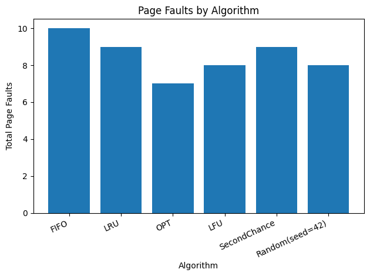
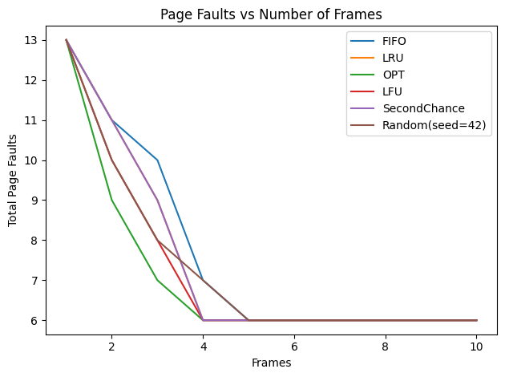

# Page Replacement Algorithm Analyzer

A comprehensive **Operating Systems** project that simulates and analyzes multiple **page replacement algorithms** to understand how modern operating systems manage memory under limited physical resources.

---

## 📌 Project Overview

Modern operating systems rely on **virtual memory** to efficiently manage limited physical RAM. Processes generate memory access requests in the form of **page references**, and when a requested page is not present in memory, a **page fault** occurs.

When memory frames are full, the operating system must decide which page to evict. This decision is governed by a **page replacement algorithm**.

This project implements a **Page Replacement Algorithm Analyzer** that simulates this behavior and compares different page replacement strategies based on their performance, measured using **page fault counts** and **graphical analysis**.

---

## 🎯 Objectives

- Simulate real-world page replacement behavior
- Implement and compare multiple replacement algorithms
- Analyze algorithm performance using page fault statistics
- Visualize results using meaningful graphs
- Strengthen conceptual understanding of memory management in operating systems

---

## 🧠 Algorithms Implemented

The following page replacement algorithms are implemented and analyzed:

- **FIFO (First In First Out)**  
  Replaces the page that has been in memory the longest.

- **LRU (Least Recently Used)**  
  Replaces the page that has not been used for the longest time.

- **Optimal (OPT)**  
  Replaces the page that will not be used for the longest time in the future (theoretical benchmark).

- **LFU (Least Frequently Used)**  
  Replaces the page with the lowest access frequency.

- **Second Chance (Clock Algorithm)**  
  An improved FIFO variant using reference bits.

- **Random Replacement**  
  Replaces a randomly selected page (baseline comparison).

---

## ⚙️ How the System Works

1. The user enters a **page reference string**
2. The user specifies the **number of memory frames**
3. Memory is initialized as empty frames
4. Each page request is processed sequentially
5. Page hits and page faults are detected
6. Replacement decisions are made based on the selected algorithm
7. Page faults are counted and tracked
8. Results are displayed step-by-step
9. Graphs are generated for performance comparison

---

## 📊 Visual Analysis & Results

### 🔹 Page Faults per Algorithm
This bar chart compares total page faults generated by each algorithm.

<p align=center>  </p>


---

### 🔹 Cumulative Page Faults Over Time
Shows how page faults accumulate as page references are processed.


---

### 🔹 Page Faults vs Number of Frames
Demonstrates how increasing memory frames affects algorithm performance.



---

## 🛠️ Technology Stack

- **Python 3**
- **Matplotlib** (for graph generation)
- Python standard libraries (`collections`, `random`, `typing`)

---

## ▶️ How to Run the Project

### 1️⃣ Clone the repository
```bash
git clone https://github.com/your-username/page-replacement-algorithm-analyzer.git
```

## Navigate to the project directory
```bash
cd page-replacement-algorithm-analyzer
```

## 3️⃣ Install dependencies
```bash
pip install -r requirements.txt
```

## 4️⃣ Run the analyzer
```bash
python src/page_replacement_analyzer.py
```

---

## 📥 Sample Input

```bash
Enter page reference string (space-separated):
7 0 1 2 0 3 0 4 2 3 0 3 2

Enter number of frames:
3
```

---

## 📂 Project Structure

```bash
page-replacement-algorithm-analyzer/
│
├── src/        # Core simulation code
├── assets/     # Images and generated graphs
├── diagrams/   # Flowcharts and diagrams
├── report/     # Academic report (PDF)
├── README.md
└── requirements.txt

``` 


## 📜 License
```bash
This project is intended for educational and academic purposes only.
```
